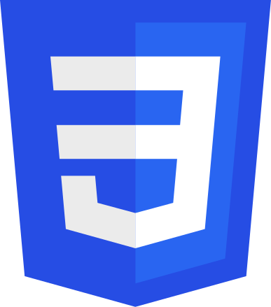

# Hi! 👋 I'm Stina! - Frontend Developer

## ✨ Projects

### Star Wars Trivia - Object Oriented assignment
> [View Trivia application](https://stormstina.github.io/star-wars-trivia/)

> [View code](https://github.com/stormstina/star-wars-trivia)

### Tamagotchi - Object Oriented assignment
> [View Tamagotchi application](https://stormstina.github.io/tamagotchi/)

> [View code](https://github.com/stormstina/tamagotchi)

### Shopping List - Group Project
> [View Shopping List application](https://stormstina.github.io/my-lists/index.html)

> [View code](https://github.com/stormstina/my-lists)

### Real-estate-Website - Group Project
> [View Real Estate website](https://stormstina.github.io/Real-Estate-website/)

> [View code](https://github.com/stormstina/Real-Estate-website)

### Quiz
> [View Quiz application](https://stormstina.github.io/Ankademin-quiz/)

> [View code](https://github.com/stormstina/Ankademin-quiz)

## Tech Stack *(as of now)*

 &nbsp;
 &nbsp;

 &nbsp;
 &nbsp;
 &nbsp;
 &nbsp;
 &nbsp;
 &nbsp;
 

