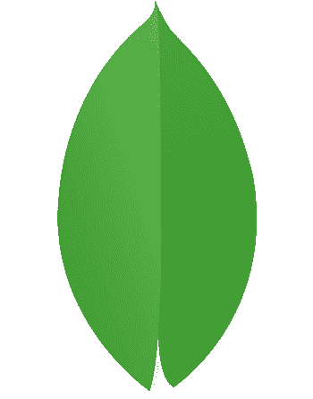

# Hej! 👋 I'm Stina - Frontend Developer

You will either find me learning JavaScript, curating the perfect Spotify playlist or watching the latest episode of *30 minuter* with ogle eyes, an open mouth and popcorn in hand.

## 💻 Own projects
### Laundry room booking system
I started working out a solution using an already existing list MongoDB database with a REST API, but after learning node.js I have migrated it to my own backend solution.
> [View API code](https://github.com/stormstina/booking-system-api)

> [View laundry room booking application](https://laundry-room-booking-system-de2d4ba71aff.herokuapp.com)

> [View client application code](https://github.com/stormstina/laundry-room-booking-system)

&nbsp; 

> [View old laundry room booking application](https://stormstina.github.io/laundry/)

> [View old code](https://github.com/stormstina/laundry)

## 📚 School projects
Make sure to read the group projects readme-file, for clarification of my responsibilities within the project.  

### Bank application
Single-Page App (SPA) with client-side routing using vanilla JS classes. Server-side powered by Node.js, Express.js, and MongoDB for user registration, account creation, and banking operations.

  Api &nbsp;
  MongoDB &nbsp;
  Node.js &nbsp;
  Express.js &nbsp;
  JavaScript &nbsp;
  HTML &nbsp;
  CSS &nbsp;
  Sass &nbsp;  

> [View bank application](https://express-bank.herokuapp.com/)

> [View code](https://github.com/stormstina/mongoDB-bank)

### Star Wars Trivia - Object Oriented assignment
  Api &nbsp;
  JavaScript &nbsp; 
  HTML &nbsp; 
  CSS &nbsp; 
  Sass &nbsp; 
  Bootstrap &nbsp; 

> [View Trivia application](https://stormstina.github.io/star-wars-trivia/)

> [View code](https://github.com/stormstina/star-wars-trivia)

### Tamagotchi - Object Oriented assignment
  JavaScript &nbsp; 
  HTML &nbsp; 
  CSS &nbsp; 
  Sass &nbsp; 

> [View Tamagotchi application](https://stormstina.github.io/tamagotchi/)

> [View code](https://github.com/stormstina/tamagotchi)

### Shopping List - Group Project
  Api &nbsp;
  Local Storage &nbsp;
  JavaScript &nbsp; 
  HTML &nbsp; 
  CSS &nbsp; 
  Sass &nbsp; 
  Bootstrap &nbsp; 

> [View Shopping List application](https://stormstina.github.io/my-lists/index.html)

> [View code](https://github.com/stormstina/my-lists)

### Real-estate-Website - Group Project
  JavaScript &nbsp; 
  HTML &nbsp; 
  CSS &nbsp; 
  Sass &nbsp; 
  Bulma &nbsp; 

> [View Real Estate website](https://stormstina.github.io/Real-Estate-website/)

> [View code](https://github.com/stormstina/Real-Estate-website)

### Quiz
  JavaScript &nbsp; 
  HTML &nbsp; 
  CSS &nbsp; 

> [View Quiz application](https://stormstina.github.io/Ankademin-quiz/)

> [View code](https://github.com/stormstina/Ankademin-quiz)

## 🛠️  Tech Stack 

   &nbsp;
   &nbsp;
  
   &nbsp;
   &nbsp;
   &nbsp;
   &nbsp;
   &nbsp;
   &nbsp;
   &nbsp;
   &nbsp;
   &nbsp;

